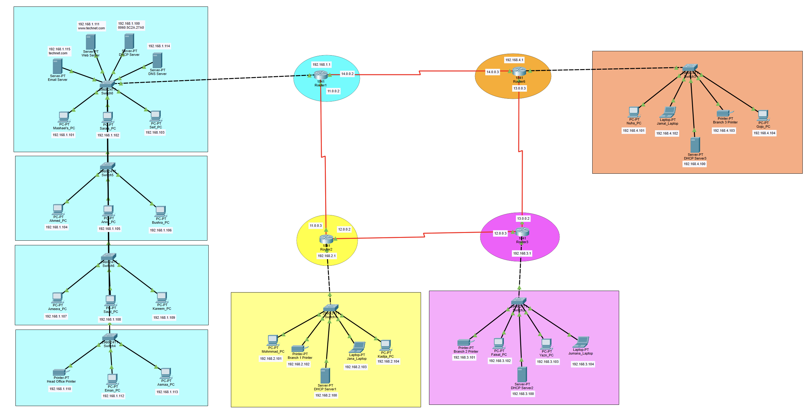

# Network Design Project

## Overview
This project presents a computer network design and simulation developed using Cisco Packet Tracer.

The project demonstrates the implementation of networking concepts including topology design, router and switch configuration, IP addressing, subnetting, and connectivity testing within a simulated environment.

A complete project report is also included to document the network structure, implementation process, and configuration details.

---

## Features
- Network topology design
- Router configuration
- Switch configuration
- IP addressing and subnetting
- Connectivity testing
- Packet Tracer simulation
- Structured project documentation

---

## Tools and Technologies
- Cisco Packet Tracer
- Networking Fundamentals
- IP Addressing
- Subnetting
- Router & Switch Configuration

---

## Project Structure

```text
Network-Design-Project/
│
├── packet-tracer/
│   └── Project.pkt
│
├── docs/
│   └── FinalProject_CS2091_Spring2025-Summary.pdf
│
├── screenshots/
│   └── topology.png
│
└── README.md
```

---

## How to Open the Project

1. Install Cisco Packet Tracer
2. Open the Packet Tracer file:

```text
packet-tracer/Project.pkt
```

3. Review the network topology and configurations.

---

## Documentation

The project report is included in:

```text
docs/FinalProject_CS2091_Spring2025-Summary.pdf
```

The report contains:
- Network overview
- Design explanation
- Configuration details
- Simulation summary

---

## Screenshot

### Network Topology


---

## Learning Outcomes
This project demonstrates:
- Practical network design skills
- Understanding of IP addressing and subnetting
- Router and switch configuration
- Network simulation and troubleshooting
- Structured technical documentation

---

## Authors
Mashael Saeed
Sarah Elshiaty
Seifeldin Elshiaty

---

## License
This project is for educational purposes only.
